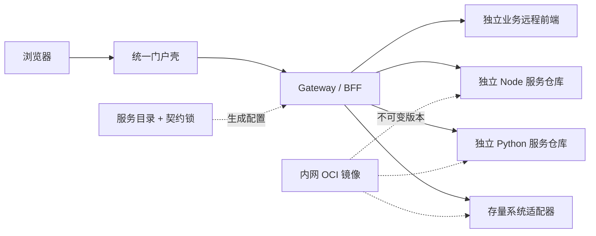

# 智能化测试平台混合仓库开发套件

这是一套面向企业内网的“平台 Monorepo + 独立业务服务仓库”参考实现。统一门户和 Gateway 保持集中治理，Node/Python/存量适配服务可以独立开发、测试、发布和扩缩容；服务目录、OpenAPI 契约锁和生成式 Compose 保留一键联调体验。

> 当前为 `0.x` 开发阶段，适合作为架构参考、内部平台起点和脚手架基线；生产落地前仍需接入组织自己的 OIDC、制品签名、审计、可观测性和灾备体系。

[快速开始](#平台本地开发) · [双层脚手架](#双层脚手架) · [架构与迁移](#架构与迁移) · [参与贡献](CONTRIBUTING.md) · [安全策略](SECURITY.md)



## 套件组成

| 目录                       | 职责                                                   |
| -------------------------- | ------------------------------------------------------ |
| `apps/portal`              | React 统一门户壳、权限菜单、主题和远程模块加载         |
| `apps/gateway`             | Fastify BFF、OIDC/RBAC、聚合、防腐适配和动态上游目录   |
| `packages`                 | 平台 UI、浏览器 SDK、微前端桥接协议和平台契约          |
| `platform`                 | 服务目录、契约锁、本地多仓路径示例                     |
| `contracts/openapi`        | 平台消费者锁定的跨语言 API 快照                        |
| `templates/business-app`   | 独立远程前端、联合清单与三种门户布局模板               |
| `templates/service-python` | FastAPI、SQLite、pytest、Ruff、mypy CRUD 后端模板      |
| `templates/service-node`   | Fastify、Node SQLite、TypeScript、Vitest CRUD 后端模板 |
| `deployment`               | 平台 Compose、镜像构建、Nginx 和内网流水线样例         |
| `scripts`                  | 服务生成/注册、契约校验、多仓联调、离线交付和冒烟测试  |

`apps/domain-service` 是为了让套件开箱可运行而保留的迁移兼容样例。新业务服务默认使用独立仓库模板，不再放入平台 Monorepo。

## 平台本地开发

要求 Node.js 22+ 与 pnpm 11.5.3+：

```powershell
corepack enable
pnpm install --frozen-lockfile
pnpm contracts:verify
pnpm dev
```

访问 `http://localhost:5173`。开发模式下 Portal、Gateway 和兼容样例服务支持热更新。

## 双层脚手架

```powershell
# 创建一个完整且独立的平台启动仓库
pnpm scaffold portal testing-platform --title "智能测试平台" --layout enterprise-sidebar --output ..\testing-platform

# 创建 React 远程前端 + Python FastAPI 后端并事务注册
pnpm scaffold app report-center "报告中心" --owner reporting-team --backend python --route /reports --web-port 4301 --api-port 4201 --output ..\report-center --register
```

业务前端源码只存在于独立业务仓库，门户通过 `mf-manifest.json` 动态加载 `./App`。Node 后端把 `--backend python` 改为 `--backend node`。旧的 `create:service` 作为兼容入口继续保留。

`--example crud --database sqlite` 生成完整 CRUD；`--example none --database none` 生成只有健康检查和受保护起步接口的空业务模板。

断网准备与使用：

```powershell
pnpm offline:prepare .\offline-bundle
pnpm scaffold app report-center "报告中心" --backend python --offline-bundle .\offline-bundle
```

离线包包含 pnpm Store、registry 元数据缓存、Python wheels、平台 tgz 及 Python/Node 业务锁文件。wheelhouse 与目标 Python 版本、操作系统和 CPU 架构相关，应在匹配目标环境的中转机生成。

## 多仓一键联调

使用服务目录中的已发布镜像：

```powershell
.\scripts\hybrid-dev.ps1 -Action up
```

使用 `platform/workspace.local.json` 指向的多个本地源码仓库：

```powershell
Copy-Item platform\workspace.local.example.json platform\workspace.local.json
pnpm hybrid:check -- --strict
.\scripts\hybrid-dev.ps1 -Action up -LocalBuild
```

不使用 Docker 时，可以按目录直接启动所有服务、远程前端、Gateway 和 Portal：

```powershell
pnpm local:dev
pnpm local:dev -- --app todo-list
```

访问 `http://localhost:8080`。生成的 `.generated` 目录和本机路径不会提交 Git。

## Python Todo 示例

仓库跟踪一个官方 Todo 全栈示例，可用于验证动态远程前端、Gateway、FastAPI、契约锁和 SQLite 数据闭环。`service-workspaces` 下其他由开发者创建的本地业务仓库仍会被忽略：

```powershell
.\scripts\start-local-todo.ps1
pnpm smoke:todo
```

访问 `http://127.0.0.1:8080`，停止时执行 `.\scripts\stop-local-todo.ps1`。详见 [Python Todo 模板验证](docs/template/TODO-LIST-DEMO.md)。

## 质量门槛

```powershell
pnpm contracts:verify
pnpm release:verify deployment/releases/release-manifest.example.json
pnpm typecheck
pnpm test
pnpm build
pnpm format:check
pnpm smoke
```

## 架构与迁移

- [混合仓库完整架构图](docs/architecture/hybrid-repository.mmd)
- [混合仓库开发路径图](docs/architecture/hybrid-development-path.mmd)
- [ADR-0005：平台仓库与独立服务仓库并存](docs/architecture/adr/0005-hybrid-repository-and-contract-lock.md)
- [现有项目迁移路径](docs/template/MIGRATION-PATH.md)
- [内网与离线部署](docs/template/INTRANET-DEPLOYMENT.md)
- [AI 最小上下文约定](docs/context/AI-DEVELOPMENT.md)
- [历史架构设计素材](docs/architecture/archive/README.md)

## 开源协作

- 提交代码前请阅读 [贡献指南](CONTRIBUTING.md) 和 [社区行为准则](CODE_OF_CONDUCT.md)。
- 使用问题和维护范围见 [支持说明](SUPPORT.md)；安全漏洞必须按 [安全策略](SECURITY.md) 私密报告。
- 版本变化记录在 [CHANGELOG](CHANGELOG.md)，维护者发布流程见 [GitHub 开源发布流程](docs/RELEASING.md)。
- 示例中的 `*.intra.example.com`、镜像摘要和组织名均为保留占位符，不对应真实基础设施。

## 许可证

本项目采用 [Apache License 2.0](LICENSE)。第三方依赖继续适用各自的许可证。
