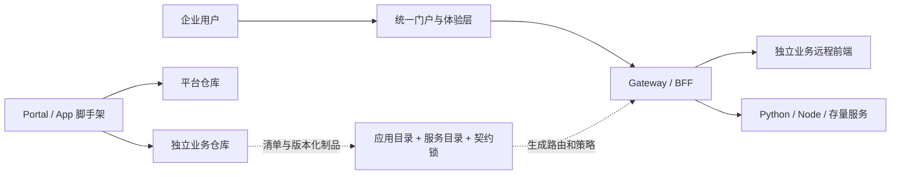

# AppLattice

企业级可组合应用平台开发与交付套件。

AppLattice 帮助团队在“统一平台体验”和“业务应用自治”之间建立稳定边界：平台仓库提供门户、Gateway、身份与权限接入、应用目录、契约治理、脚手架和离线交付能力；每个业务应用仍以独立全栈仓库开发、测试和发布，并在运行时装配进统一门户。

> 当前处于 `0.x` 阶段，适合作为内部开发者平台起点、架构参考和脚手架基线。生产落地仍需接入组织自己的 OIDC、密钥管理、制品签名、审计、可观测性和灾备体系。

[从零开始](#从零开始运行完整示例) · [创建自己的平台](#从零创建自己的平台与应用) · [命令速查](#常用命令速查) · [架构](docs/architecture/ARCHITECTURE.md) · [项目定位](docs/POSITIONING.md) · [参与贡献](CONTRIBUTING.md)



## 先选择你的目标

| 目标             | 推荐路径                                        | 完成后得到什么                                        |
| ---------------- | ----------------------------------------------- | ----------------------------------------------------- |
| 先确认项目能运行 | [运行内置 Todo 示例](#从零开始运行完整示例)     | Portal、Gateway、远程前端、FastAPI 和 SQLite 完整链路 |
| 创建自己的平台   | [生成 Portal + App](#从零创建自己的平台与应用)  | 一个独立平台仓库和一个独立业务仓库                    |
| 只开发平台内核   | 执行 `pnpm dev`                                 | Portal、Gateway 和兼容领域服务，不启动独立业务应用    |
| 接入已有系统     | 阅读[迁移路径](docs/template/MIGRATION-PATH.md) | 按 API 代理、前端迁移、独立发布逐步接入               |
| 在断网环境初始化 | 阅读[离线准备](#内网与离线初始化)               | pnpm 缓存、Python wheels 和 AppLattice tgz            |

第一次接触 AppLattice，建议先完整执行 Todo 示例，再创建自己的平台。两条路径使用不同端口和启动命令，不要混用。

## 环境准备

### 必需环境

| 工具                                      | 版本            | 用途                                 |
| ----------------------------------------- | --------------- | ------------------------------------ |
| [Git](https://git-scm.com/downloads/)     | 当前维护版本    | 克隆仓库                             |
| [Node.js](https://nodejs.org/en/download) | `22` 或更高     | Portal、Gateway、CLI 和 Node 服务    |
| [pnpm](https://pnpm.io/installation)      | `11.5.3` 或更高 | JavaScript 工作区和锁文件安装        |
| PowerShell                                | `7` 推荐        | Windows 本地全栈启动、停止和离线脚本 |

运行 Todo 或生成 Python 应用时还需要：

| 工具                                                          | 版本             | 用途                      |
| ------------------------------------------------------------- | ---------------- | ------------------------- |
| Python                                                        | `3.12` 或 `3.13` | FastAPI 后端              |
| [uv](https://docs.astral.sh/uv/getting-started/installation/) | 当前维护版本     | Python 环境、锁文件和测试 |

Docker 不是本地开发的必需条件；只有验证镜像和 Compose 时才需要 Docker Desktop 或 Docker Engine。

### 检查环境

在 PowerShell 中执行：

```powershell
git --version
node --version
corepack enable pnpm
pnpm --version
python --version
uv --version
```

如果只开发 Node 应用，可以忽略最后两条。仓库的 `package.json` 固定了 pnpm 版本，启用 Corepack 后会自动使用该版本。

如果本机没有合适的 Python，uv 也可以安装：

```powershell
uv python install 3.12
```

## 从零开始运行完整示例

这条路径会运行仓库内置的 Todo 应用，适合第一次验证 AppLattice。所有命令都从普通 PowerShell 执行，不需要 Docker。

### 第 1 步：克隆并安装平台依赖

```powershell
git clone https://github.com/hhs44/applattice.git
Set-Location applattice

corepack enable pnpm
pnpm install --frozen-lockfile
```

此时只安装了平台 Monorepo 的依赖。Todo 模拟一个独立业务仓库，因此需要单独安装。

### 第 2 步：安装 Todo 独立仓库依赖

```powershell
Set-Location service-workspaces\todo-list-service

uv sync --locked
pnpm install --frozen-lockfile

Set-Location ..\..
```

执行完成后，Todo 目录中应存在 `.venv` 和 `node_modules`。它们不会被提交到 Git。

### 第 3 步：启动完整链路

```powershell
.\scripts\start-local-todo.ps1
```

首次启动会执行契约校验、构建、前后端类型检查和测试，然后启动五个进程：

| 组件          | 地址                    | 说明                    |
| ------------- | ----------------------- | ----------------------- |
| Portal        | `http://127.0.0.1:8080` | 用户访问的统一入口      |
| Gateway       | `http://127.0.0.1:4000` | 浏览器唯一后端入口      |
| 兼容领域服务  | `http://127.0.0.1:4100` | 平台迁移兼容示例        |
| Todo API      | `http://127.0.0.1:4200` | Python FastAPI 独立后端 |
| Todo 远程前端 | `http://127.0.0.1:4300` | 由 Portal 动态加载      |

打开 `http://127.0.0.1:8080`，进入“Todo 清单”，验证新增、编辑、完成和删除。开发模式使用模拟身份和权限，不需要先配置 OIDC；该模式禁止用于生产环境。

### 第 4 步：运行端到端冒烟测试

保持服务运行，另开一个 PowerShell 窗口：

```powershell
Set-Location <你的 applattice 目录>
pnpm smoke:todo
```

看到冒烟测试通过，代表以下链路已经工作：

```text
Browser -> Portal -> Gateway -> Todo FastAPI -> SQLite
                \-> Todo remote frontend (mf-manifest.json / ./App)
```

### 第 5 步：停止服务

```powershell
.\scripts\stop-local-todo.ps1
```

运行日志保留在 `.tmp/local-todo-runtime`，Todo 数据保留在 `service-workspaces/todo-list-service/.data/todos.db`。再次启动前如果提示状态文件已存在，先执行停止脚本。

## 从零创建自己的平台与应用

这条路径会创建两个同级、相互独立的仓库：一个平台仓库和一个全栈业务仓库。

```text
workspace/
├─ applattice/          # 用来执行生成器的源码仓库
├─ acme-platform/       # 生成的平台仓库：Portal、Gateway、目录和脚手架
└─ inventory-app/       # 生成的业务仓库：React 前端 + Python 后端
```

生成完成后，日常开发只需要 `acme-platform` 和 `inventory-app`；业务前端源码不会进入平台 Portal。

### 第 1 步：生成平台仓库

先在已经安装依赖的 AppLattice 源码仓库根目录执行：

```powershell
pnpm scaffold portal acme-platform `
  --title "ACME 企业应用平台" `
  --layout enterprise-sidebar `
  --default-theme light `
  --themes light,dark,system `
  --primary-color "#1672e5" `
  --portal-port 8080 `
  --gateway-port 4000 `
  --output ..\acme-platform
```

脚手架会先在临时目录生成并验证，成功后再移动到目标位置；目标目录已存在、端口冲突或参数不合法时会拒绝覆盖。默认会执行 `pnpm install`。

可选布局：

- `enterprise-sidebar`：企业管理平台常用的侧边导航。
- `modern-topnav`：顶部导航和宽内容区。
- `ops-console`：深色、高密度运维控制台。

### 第 2 步：在新平台中生成 Python 业务应用

```powershell
Set-Location ..\acme-platform

pnpm scaffold app inventory "库存管理" `
  --owner inventory-team `
  --backend python `
  --route /inventory `
  --web-port 4300 `
  --api-port 4200 `
  --database sqlite `
  --example crud `
  --output ..\inventory-app `
  --register
```

默认行为：

- 安装业务前端依赖；
- 创建 Python `.venv` 并安装 FastAPI 与开发工具；
- 将版本化的 AppLattice UI/Bridge tgz 写入业务仓库 `vendor`；
- 把应用和服务写入平台目录；
- 复制并锁定业务 OpenAPI；
- 写入仅本机使用的 `platform/workspace.local.json`。

如果暂时只想生成文件，使用 `--skip-install --no-register`。如果只想检查参数和目标路径，使用 `--dry-run`。

### 第 3 步：检查注册结果

在 `acme-platform` 根目录执行：

```powershell
pnpm contracts:verify
pnpm hybrid:check -- --strict
```

主要变化应包括：

- `platform/app-catalog.json` 中出现 `inventory`；
- `platform/service-catalog.json` 中出现 `inventory-service`；
- `platform/contracts.lock.json` 中出现对应契约摘要；
- `contracts/openapi` 中出现锁定的 OpenAPI 快照；
- `platform/workspace.local.json` 指向 `..\inventory-app`。

### 第 4 步：启动平台和指定应用

```powershell
pnpm local:dev -- --app inventory
```

启动器会检查端口、构建平台基础包、启动业务后端、业务远程前端、Gateway 和 Portal，并等待各服务健康。看到以下输出后访问门户：

```text
平台已就绪：http://127.0.0.1:8080
```

使用 `Ctrl+C` 停止所有子进程。日志位于 `.tmp/local-platform/logs`。

### 第 5 步：开始业务开发

业务代码在 `inventory-app` 中维护：

```text
inventory-app/
├─ frontend/                    # React + Vite 独立开发壳和 ./App 远程入口
├─ backend/                     # FastAPI、SQLite、测试和健康检查
├─ contracts/                   # OpenAPI 与生成客户端
├─ vendor/                      # AppLattice UI/Bridge 离线 tgz
├─ deployment/                  # Dockerfile 和 Compose
├─ platform-app.manifest.json   # 应用注册的唯一来源
├─ AGENTS.md
└─ README.md
```

只开发前端时可以在 `inventory-app/frontend` 执行 `pnpm dev`，使用独立开发壳和 HMR；需要验证 Portal、权限、Gateway 和深链接时，回到平台仓库执行 `pnpm local:dev -- --app inventory`。

## 脚手架参数速查

### Portal

```powershell
pnpm scaffold portal <平台ID> --title <名称> [选项]
```

| 参数              | 默认值               | 说明                        |
| ----------------- | -------------------- | --------------------------- |
| `--layout`        | `enterprise-sidebar` | 三种门户布局之一            |
| `--default-theme` | `light`              | `light`、`dark` 或 `system` |
| `--themes`        | `light,dark,system`  | 允许用户切换的主题          |
| `--primary-color` | `#1672e5`            | 六位十六进制品牌色          |
| `--portal-port`   | `8080`               | 生成平台的 Portal 端口      |
| `--gateway-port`  | `4000`               | Gateway 端口                |
| `--output`        | `generated/<平台ID>` | 输出目录                    |
| `--skip-install`  | 关闭                 | 生成后不安装依赖            |
| `--dry-run`       | 关闭                 | 只校验并显示生成计划        |

### App

```powershell
pnpm scaffold app <应用ID> <应用名称> [选项]
```

| 参数               | 默认值                        | 说明                           |
| ------------------ | ----------------------------- | ------------------------------ |
| `--backend`        | `python`                      | `python` 或 `node`             |
| `--route`          | `/<应用ID>`                   | 门户路由                       |
| `--web-port`       | `4300`                        | 远程前端端口                   |
| `--api-port`       | `4200`                        | 业务 API 端口                  |
| `--database`       | `sqlite`                      | `sqlite` 或 `none`             |
| `--example`        | `crud`                        | `crud` 或 `none`               |
| `--owner`          | `platform-team`               | 应用负责人或团队               |
| `--output`         | `service-workspaces/<应用ID>` | 独立业务仓库路径               |
| `--no-register`    | 关闭                          | 不写入当前平台目录             |
| `--skip-install`   | 关闭                          | 不安装 Node/Python 依赖        |
| `--offline-bundle` | 无                            | 从指定离线包安装，禁止访问公网 |
| `--dry-run`        | 关闭                          | 只校验参数、冲突和输出路径     |

`--example crud` 必须与 `--database sqlite` 一起使用；空模板应使用 `--example none --database none`。

## 常用命令速查

所有命令默认在平台仓库根目录执行：

| 命令                            | 用途                            | 默认入口                       |
| ------------------------------- | ------------------------------- | ------------------------------ |
| `pnpm dev`                      | 只开发 AppLattice 平台内核      | Portal `http://localhost:5173` |
| `pnpm local:dev`                | 启动目录中所有本地应用和服务    | Portal `http://127.0.0.1:8080` |
| `pnpm local:dev -- --app <id>`  | 只启动一个应用及其依赖          | Portal `http://127.0.0.1:8080` |
| `pnpm register:app -- <路径>`   | 注册已经存在的业务仓库          | 修改目录、契约锁和本地映射     |
| `pnpm contracts:verify`         | 校验应用、服务和 OpenAPI 契约   | 无服务启动                     |
| `pnpm hybrid:check -- --strict` | 检查多仓路径、清单和 Dockerfile | 无服务启动                     |
| `pnpm typecheck`                | 全平台 TypeScript 检查          | 无服务启动                     |
| `pnpm test`                     | 平台单测和脚手架测试            | 无服务启动                     |
| `pnpm build`                    | 全平台生产构建                  | 输出到各项目 `dist`            |
| `pnpm format:check`             | 检查代码格式                    | 无文件修改                     |

`pnpm dev` 和 `pnpm local:dev` 不是同一个模式：前者只启动平台 Monorepo，后者会读取应用目录和本地工作区映射，适合远程业务应用联调。

## 现有业务仓库接入

如果业务仓库已经由脚手架生成但尚未注册：

```powershell
pnpm register:app -- ..\inventory-app
pnpm contracts:verify
pnpm local:dev -- --app inventory
```

如果是存量项目，不建议直接复制到 Portal。推荐顺序：

1. 为现有后端补充健康检查和 OpenAPI。
2. 先通过 Gateway 代理 API，禁止浏览器直连后端。
3. 将业务前端改造成可独立运行的远程模块。
4. 补充 `platform-app.manifest.json` 和权限规则。
5. 注册到应用目录并完成契约锁定。
6. 最后再拆分独立发布和部署流水线。

完整说明见[现有项目迁移路径](docs/template/MIGRATION-PATH.md)。

## 内网与离线初始化

在能访问依赖源、且操作系统、CPU 架构和 Python 版本与目标环境一致的中转机上准备：

```powershell
pnpm offline:prepare .\offline-bundle
```

将 `offline-bundle` 复制到断网环境后：

```powershell
pnpm scaffold app inventory "库存管理" `
  --backend python `
  --offline-bundle .\offline-bundle `
  --output ..\inventory-app
```

离线包包含 pnpm Store、registry 元数据缓存、Python wheels、AppLattice tgz 和业务模板锁文件。离线模式禁止访问公网，缺少制品时会列出缺失项。详细要求见[内网与离线部署](docs/template/INTRANET-DEPLOYMENT.md)。

## 常见问题

### 为什么打开 `5173` 看不到生成的业务应用？

`pnpm dev` 只启动平台内核。请在已注册应用的平台仓库中执行：

```powershell
pnpm local:dev -- --app <应用ID>
```

然后访问 `http://127.0.0.1:8080`。

### 提示端口已占用怎么办？

Todo 示例使用 `4000`、`4100`、`4200`、`4300` 和 `8080`。先停止之前的运行实例，或在生成应用时指定不同的 `--web-port`、`--api-port`。脚手架会拒绝目录中已经登记的冲突端口。

### 提示 `.venv` 不存在怎么办？

在业务仓库的 Python 后端目录执行：

```powershell
uv sync --locked
```

如果生成应用时使用了 `--skip-install`，还需要在业务仓库根目录执行 `pnpm install --frozen-lockfile`。

### Todo 提示本地运行状态已存在怎么办？

```powershell
.\scripts\stop-local-todo.ps1
.\scripts\start-local-todo.ps1
```

### 可以把业务前端直接写到 Portal 吗？

不可以。Portal 只拥有登录、导航、主题、权限和远程加载内核。业务页面必须位于独立业务仓库，通过 `mf-manifest.json` 和 `./App` 在运行时加载。

### 可以直接从业务前端请求 FastAPI/Node 地址吗？

不可以。浏览器必须访问 `/api/apps/:appId/*`，由 Gateway 验证身份、权限、方法和路径后代理到业务服务。

## 解决什么问题

- 统一入口：登录、导航、主题、权限与应用发现由平台集中治理。
- 独立交付：业务前端和后端保留在自己的仓库，不随门户源码膨胀。
- 多技术栈协作：浏览器统一通过 Gateway 访问 Python、Node 和存量服务。
- 契约化集成：应用清单、OpenAPI、协议版本和默认拒绝的代理规则减少隐式耦合。
- 可复制工程能力：用同一套 CLI 创建新门户或独立全栈应用。
- 内网与离线交付：平台包可固化为 tgz，依赖可准备为 pnpm 缓存、Python wheels 和本地镜像。
- AI 友好开发：按平台、应用和契约拆分上下文，使 AI 无需反复读取整个系统。

AppLattice 不是测试管理产品、低代码业务建模器或完整云原生控制面。测试平台、运维工作台、数据门户和内部管理系统都可以是它承载的业务场景。

## 套件组成

| 目录                       | 职责                                              |
| -------------------------- | ------------------------------------------------- |
| `apps/portal`              | React 统一门户壳、权限菜单、主题和远程模块加载    |
| `apps/gateway`             | Fastify BFF、OIDC/RBAC 接入、聚合和动态上游代理   |
| `packages`                 | UI、浏览器 SDK、微前端桥接协议和共享契约          |
| `platform`                 | 应用目录、服务目录、契约锁和本地多仓映射          |
| `contracts/openapi`        | 平台消费方锁定的跨语言 API 快照                   |
| `templates/business-app`   | 独立远程前端和联合清单模板                        |
| `templates/service-python` | FastAPI、SQLite、pytest、Ruff、mypy 后端模板      |
| `templates/service-node`   | Fastify、Node SQLite、TypeScript、Vitest 后端模板 |
| `tools/scaffold`           | Portal 与 App 双层脚手架 CLI                      |
| `deployment`               | Compose、镜像构建、Nginx 和内网交付样例           |

`apps/domain-service` 是为开箱运行保留的迁移兼容样例，不是新业务的默认落点。新应用默认生成独立全栈仓库。

## 质量门禁

提交平台级改动前运行：

```powershell
pnpm contracts:verify
pnpm release:verify deployment/releases/release-manifest.example.json
pnpm typecheck
pnpm test
pnpm build
pnpm format:check
```

Todo 独立仓库的测试与 OpenAPI 导出方法见 [Todo 模板验证](docs/template/TODO-LIST-DEMO.md)。

## 架构与治理

- [当前架构说明](docs/architecture/ARCHITECTURE.md)
- [产品定位与价值](docs/POSITIONING.md)
- [混合仓库架构图](docs/architecture/hybrid-repository.mmd)
- [混合仓库开发路径图](docs/architecture/hybrid-development-path.mmd)
- [ADR-0005：平台仓库与独立服务仓库并存](docs/architecture/adr/0005-hybrid-repository-and-contract-lock.md)
- [ADR-0006：门户与业务应用双层脚手架](docs/architecture/adr/0006-portal-and-business-app-scaffolds.md)
- [ADR-0007：项目重新定义为 AppLattice](docs/architecture/adr/0007-redefine-as-applattice.md)
- [AI 最小上下文约定](docs/context/AI-DEVELOPMENT.md)
- [前身项目历史资料](docs/architecture/archive/README.md)

## 开源协作

提交代码前请阅读 [贡献指南](CONTRIBUTING.md) 和 [社区行为准则](CODE_OF_CONDUCT.md)。支持范围见 [SUPPORT](SUPPORT.md)，安全漏洞请按 [安全策略](SECURITY.md) 私密报告。版本发布流程见 [RELEASING](docs/RELEASING.md)。

示例中的 `*.example`、镜像摘要和组织名均为占位符，不对应真实基础设施。

## 许可证

本项目采用 [Apache License 2.0](LICENSE)。第三方依赖继续适用各自的许可证。
