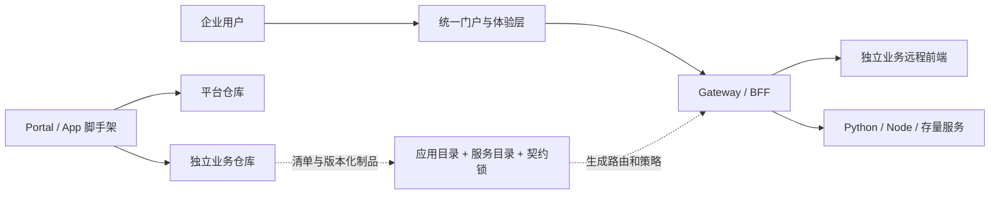

# AppLattice

企业级可组合应用平台开发与交付套件。

AppLattice 帮助团队在“统一平台体验”和“业务应用自治”之间建立稳定边界：平台仓库提供门户、Gateway、身份与权限接入、应用目录、契约治理、脚手架和离线交付能力；每个业务应用仍以独立全栈仓库开发、测试和发布，并在运行时装配进统一门户。

> 当前处于 `0.x` 阶段，适合作为内部开发者平台起点、架构参考和脚手架基线。生产落地仍需接入组织自己的 OIDC、密钥管理、制品签名、审计、可观测性和灾备体系。

[快速开始](#快速开始) · [双层脚手架](#双层脚手架) · [架构](docs/architecture/ARCHITECTURE.md) · [项目定位](docs/POSITIONING.md) · [参与贡献](CONTRIBUTING.md)



## 解决什么问题

- 统一入口：登录、导航、主题、权限与应用发现由平台集中治理。
- 独立交付：业务前端和后端保留在自己的仓库，不随门户源码膨胀。
- 多技术栈协作：浏览器统一通过 Gateway 访问 Python、Node 和存量服务。
- 契约化集成：应用清单、OpenAPI、协议版本和默认拒绝的代理规则减少隐式耦合。
- 可复制工程能力：用同一套 CLI 创建新门户或独立全栈应用。
- 内网与离线交付：平台包可固化为 tgz，依赖可准备为 pnpm 缓存、Python wheels 和本地镜像。
- AI 友好开发：按平台、应用和契约拆分上下文，使 AI 无需反复读取整个系统。

AppLattice 不是测试管理产品、低代码业务建模器或完整云原生控制面。测试平台、运维工作台、数据门户和内部管理系统都可以是它承载的业务场景。

## 套件组成

| 目录                       | 职责                                              |
| -------------------------- | ------------------------------------------------- |
| `apps/portal`              | React 统一门户壳、权限菜单、主题和远程模块加载    |
| `apps/gateway`             | Fastify BFF、OIDC/RBAC 接入、聚合和动态上游代理   |
| `packages`                 | UI、浏览器 SDK、微前端桥接协议和共享契约          |
| `platform`                 | 应用目录、服务目录、契约锁和本地多仓映射          |
| `contracts/openapi`        | 平台消费方锁定的跨语言 API 快照                   |
| `templates/business-app`   | 独立远程前端和联合清单模板                        |
| `templates/service-python` | FastAPI、SQLite、pytest、Ruff、mypy 后端模板      |
| `templates/service-node`   | Fastify、Node SQLite、TypeScript、Vitest 后端模板 |
| `tools/scaffold`           | Portal 与 App 双层脚手架 CLI                      |
| `deployment`               | Compose、镜像构建、Nginx 和内网交付样例           |

`apps/domain-service` 是为开箱运行保留的迁移兼容样例，不是新业务的默认落点。新应用默认生成独立全栈仓库。

## 快速开始

需要 Node.js 22+ 和 pnpm 11.5.3+：

```powershell
corepack enable
pnpm install --frozen-lockfile
pnpm contracts:verify
pnpm dev
```

默认门户地址为 `http://localhost:5173`。

## 双层脚手架

```powershell
# 创建完整、独立的平台启动仓库
pnpm scaffold portal enterprise-platform --title "企业应用平台" --layout enterprise-sidebar --output ..\enterprise-platform

# 创建 React 远程前端 + Python FastAPI 后端，并注册到当前平台
pnpm scaffold app report-center "报告中心" --owner reporting-team --backend python --route /reports --web-port 4301 --api-port 4201 --output ..\report-center --register
```

业务前端源码只存在于独立应用仓库，门户通过 `mf-manifest.json` 动态加载 `./App`。将 `--backend python` 改为 `--backend node` 即可生成 Node 后端。旧的 `create:service` 命令作为兼容入口暂时保留。

断网环境可先准备离线包：

```powershell
pnpm offline:prepare .\offline-bundle
pnpm scaffold app report-center "报告中心" --backend python --offline-bundle .\offline-bundle
```

离线包包含 pnpm Store、registry 元数据缓存、Python wheels、AppLattice tgz 和业务模板锁文件。wheelhouse 必须在与目标环境匹配的 Python 版本、操作系统和 CPU 架构上生成。

## 多仓联调

使用已发布镜像：

```powershell
.\scripts\hybrid-dev.ps1 -Action up
```

使用 `platform/workspace.local.json` 指向多个本地源码仓库：

```powershell
Copy-Item platform\workspace.local.example.json platform\workspace.local.json
pnpm hybrid:check -- --strict
.\scripts\hybrid-dev.ps1 -Action up -LocalBuild
```

不使用 Docker 时，可启动 Portal、Gateway 和选定业务应用：

```powershell
pnpm local:dev
pnpm local:dev -- --app todo-list
```

生成的 `.generated` 目录和本机路径不会提交到 Git。

## Todo 验证应用

`service-workspaces/todo-list-service` 是 Python 全栈验证应用，用于覆盖动态远程前端、Gateway、FastAPI、契约锁和 SQLite 数据闭环。它验证平台能力，不代表 AppLattice 的业务定位。

```powershell
.\scripts\start-local-todo.ps1
pnpm smoke:todo
```

访问 `http://127.0.0.1:8080`，停止时执行 `.\scripts\stop-local-todo.ps1`。详见 [Todo 模板验证](docs/template/TODO-LIST-DEMO.md)。

## 质量门禁

```powershell
pnpm contracts:verify
pnpm release:verify deployment/releases/release-manifest.example.json
pnpm typecheck
pnpm test
pnpm build
pnpm format:check
pnpm smoke
```

## 架构与治理

- [当前架构说明](docs/architecture/ARCHITECTURE.md)
- [产品定位与价值](docs/POSITIONING.md)
- [混合仓库架构图](docs/architecture/hybrid-repository.mmd)
- [混合仓库开发路径图](docs/architecture/hybrid-development-path.mmd)
- [ADR-0005：平台仓库与独立服务仓库并存](docs/architecture/adr/0005-hybrid-repository-and-contract-lock.md)
- [ADR-0006：门户与业务应用双层脚手架](docs/architecture/adr/0006-portal-and-business-app-scaffolds.md)
- [ADR-0007：项目重新定义为 AppLattice](docs/architecture/adr/0007-redefine-as-applattice.md)
- [现有项目迁移路径](docs/template/MIGRATION-PATH.md)
- [内网与离线部署](docs/template/INTRANET-DEPLOYMENT.md)
- [AI 最小上下文约定](docs/context/AI-DEVELOPMENT.md)
- [前身项目历史资料](docs/architecture/archive/README.md)

## 开源协作

提交代码前请阅读 [贡献指南](CONTRIBUTING.md) 和 [社区行为准则](CODE_OF_CONDUCT.md)。支持范围见 [SUPPORT](SUPPORT.md)，安全漏洞请按 [安全策略](SECURITY.md) 私密报告。版本发布流程见 [RELEASING](docs/RELEASING.md)。

示例中的 `*.example`、镜像摘要和组织名均为占位符，不对应真实基础设施。

## 许可证

本项目采用 [Apache License 2.0](LICENSE)。第三方依赖继续适用各自的许可证。
