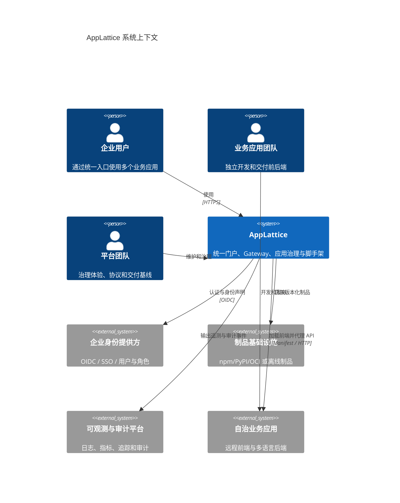
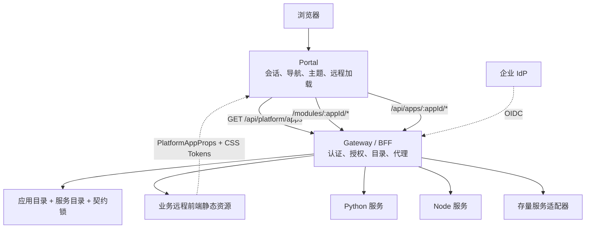

# AppLattice 架构

## 1. 架构目标

AppLattice 是企业级可组合应用平台的开发与交付套件。它把跨应用需要统一的能力收敛到平台，把业务变化频繁的代码留在独立应用仓库，并用显式清单、契约和版本化制品连接两者。

核心约束：

1. 门户统一体验，但不拥有业务页面源码。
2. 浏览器只通过 Gateway 访问业务 API，不直连服务。
3. 业务应用独立构建、测试和发布，不依赖平台仓库的 `workspace:*` 包。
4. 跨仓集成通过应用清单、OpenAPI、事件 Schema、npm/PyPI 制品或镜像完成。
5. 未声明的 API 方法和路径默认拒绝。
6. 单个远程应用失败不能导致门户或其他应用不可用。

## 2. 系统上下文



身份提供方、制品仓库和可观测平台是生产集成点，不是本仓库承诺的完整实现。开发模式提供最小替代能力，便于本地验证。

## 3. 逻辑分层

| 平面 | 组件 | 责任 |
| --- | --- | --- |
| 体验平面 | Portal、布局、主题、UI、远程加载器 | 登录后的统一入口、导航、品牌和故障隔离 |
| 接入平面 | Gateway / BFF | 身份校验、权限、同源代理、聚合、关联 ID 和策略执行 |
| 治理平面 | 应用目录、服务目录、契约锁、桥接协议 | 描述应用、约束路由、锁定接口和发现兼容性问题 |
| 开发平面 | Portal/App 脚手架、SDK、模板、本地启动器 | 生成一致工程、缩短接入路径、支持多仓联调 |
| 交付平面 | tgz、wheels、镜像、Compose、离线包 | 将源码边界转化为可验证、可搬运的制品边界 |
| 业务平面 | 独立远程前端与 Python/Node/存量服务 | 业务规则、数据模型、数据库和独立发布流水线 |

## 4. 运行时容器



### Portal

- 只拥有会话、导航、主题、布局、平台概览和远程模块运行内核。
- 根据当前用户权限获取可见应用，不直接读取服务目录。
- 通过 Suspense、错误边界、超时和重试隔离远程应用故障。
- 与远程应用共享 React/ReactDOM，并检查桥接协议版本。

### Gateway

- 是浏览器访问后端的唯一入口。
- 根据应用清单和服务目录生成允许的上游路由。
- 校验身份、HTTP 方法、路径前缀和权限；无匹配规则时拒绝。
- 代理远程模块资源和业务 API，并传播关联 ID。
- 生产环境的限流、分布式追踪和集中审计需要与企业基础设施集成。

### 治理文件

- `platform/app-catalog.json`：用户可见应用、远程前端和导航来源。
- `platform/service-catalog.json`：业务上游、健康检查和 API 策略来源。
- `platform/contracts.lock.json`：平台消费的 OpenAPI 快照及摘要。
- `platform/workspace.local.json`：仅本地存在的多仓源码映射。
- `platform-app.manifest.json`：业务仓库的唯一注册来源。

## 5. 关键接口

### 远程前端协议

```ts
type PlatformAppProps = {
  basePath: string;
  principal: {
    id: string;
    name: string;
    roles: string[];
    permissions: string[];
  };
  client: {
    request<T>(options: {
      path: string;
      method?: string;
      body?: unknown;
      idempotencyKey?: string;
    }): Promise<T>;
  };
  navigate(path: string): void;
};
```

远程应用通过 `@applattice/microfrontend-bridge` 获取类型契约，通过 `@applattice/ui` 和 CSS 变量继承门户视觉，通过 `@applattice/sdk` 调用同源 Gateway。

### HTTP 路由

| 路由 | 所有者 | 用途 |
| --- | --- | --- |
| `GET /api/platform/apps` | Gateway | 返回当前主体可见应用 |
| `/modules/:appId/*` | Gateway | 同源代理远程前端资源 |
| `/api/apps/:appId/*` | Gateway | 认证、授权并代理业务 API |
| `/health` | 各服务 | 本地编排和部署健康检查 |

## 6. 仓库与所有权

```text
AppLattice 平台仓库
├─ Portal / Gateway
├─ SDK / UI / Bridge / Contracts
├─ Catalogs / Contract lock
├─ Scaffolds / local orchestrator
└─ Platform deployment composition

独立业务应用仓库（每个应用一个）
├─ Remote frontend
├─ Python / Node backend
├─ Business database and migrations
├─ OpenAPI and generated client
├─ Platform manifest
└─ Independent build and release pipeline
```

平台团队拥有跨应用协议和体验基线；业务团队拥有业务逻辑、数据和服务 SLO。平台升级不能要求业务仓库直接引用平台工作区源码。

## 7. 关键质量属性

- **自治性**：业务应用可独立版本、回滚和扩缩容。
- **故障隔离**：远程模块失败显示应用级降级页，不影响平台壳。
- **安全性**：Gateway 默认拒绝未声明路由；生产身份由企业 IdP 提供。
- **可演进性**：桥接协议、SDK 和 UI 作为版本化制品发布。
- **可移植性**：支持在线 registry，也支持固化 tgz、wheels 和本地镜像。
- **AI 上下文效率**：平台改动、应用改动和契约改动具有可单独读取的边界。

## 8. 风险与控制

| 风险 | 控制 |
| --- | --- |
| 远程前端协议漂移 | 协议版本检查、共享依赖约束、生成模板和契约测试 |
| Gateway 成为瓶颈或单点 | 无状态设计、水平扩展、超时/熔断、生产可观测集成 |
| 应用目录与真实部署不一致 | 清单作为唯一注册来源、摘要校验、发布前健康验证 |
| 平台包升级破坏应用 | 语义化版本、兼容窗口、升级矩阵和示例应用门禁 |
| 离线包不可复现 | 锁文件、摘要、目标环境匹配的 wheels 和不可变镜像 |
| 门户重新吸收业务代码 | 仓库边界、代码审查规则和应用脚手架作为默认路径 |

## 9. 演进路径

1. 稳定清单、Gateway 策略和远程模块协议。
2. 用 Todo 验证 Python 全栈初始化与独立运行。
3. 验证 Node 模板、三种门户布局和离线生成。
4. 接入真实 OIDC、审计和可观测基础设施。
5. 建立平台包兼容矩阵、签名和自动升级检查。
6. 将真实存量项目按“先代理 API、再迁前端、最后独立发布”渐进迁移。

决策依据见 [ADR-0005](adr/0005-hybrid-repository-and-contract-lock.md)、[ADR-0006](adr/0006-portal-and-business-app-scaffolds.md) 和 [ADR-0007](adr/0007-redefine-as-applattice.md)。历史测试领域设计仅保留在 [archive](archive/README.md) 中。
